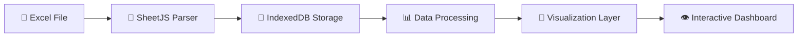

<div align="center">

# 🚗💎 Uber RD | Analytics Command Center Premium


**Transformando datos en decisiones inteligentes** 🧠📊

---

[🚀 Inicio Rápido](#-inicio-rápido) •
[📖 Documentación](#-manual-de-usuario) •
[🛠 Tecnologías](#-stack-tecnológico) •
[💡 Características](#-características-principales)

</div>

---

## 📋 Tabla de Contenidos

- [🎯 Visión General](#-visión-general)
- [❗ El Problema](#-el-problema)
- [✨ La Solución](#-la-solución)
- [💡 Características Principales](#-características-principales)
- [🛠 Stack Tecnológico](#-stack-tecnológico)
- [🚀 Inicio Rápido](#-inicio-rápido)
- [📖 Manual de Usuario](#-manual-de-usuario)
- [💾 Estructura de Datos](#-estructura-de-datos-requerida)
- [⚙️ Configuración Avanzada](#️-configuración-avanzada)
- [🎨 Personalización](#-personalización)
- [🔒 Seguridad y Privacidad](#-seguridad-y-privacidad)
- [📄 Licencia](#-licencia)

---

## 🎯 Visión General

> **Una plataforma de Business Intelligence revolucionaria que corre 100% en tu navegador**

El **Analytics Command Center Premium** es una solución empresarial de análisis de datos diseñada específicamente para la gestión de flotas de Uber en República Dominicana. Sin necesidad de servidores, sin costos de infraestructura, sin complejidad.

### 🎭 ¿Por qué es diferente?

| 🏆 Característica | 💪 Beneficio |
|-------------------|--------------|
| **Zero Backend** | No hay servidores que mantener ni costos de hosting |
| **100% Privado** | Tus datos NUNCA salen de tu computadora |
| **Offline-First** | Funciona sin internet después de la carga inicial |
| **Persistencia Inteligente** | Los datos persisten automáticamente entre sesiones |

---

## ❗ El Problema

### 🔥 Desafíos Actuales en la Gestión de Flotas

<table>
<tr>
<td width="50%">

#### 📊 **Fragmentación de Datos**
- Información dispersa en múltiples hojas Excel
- Difícil de consolidar y analizar
- Propenso a errores humanos

</td>
<td width="50%">

#### ⏰ **Falta de Visibilidad en Tiempo Real**
- No hay herramientas nativas de visualización
- Imposible ver patrones geográficos
- Análisis manual tedioso y lento

</td>
</tr>
<tr>
<td width="50%">

#### 💰 **Análisis Financiero Complejo**
- Cálculos de rentabilidad manuales
- Difícil rastrear OKRs y métricas
- Segmentación por método de pago complicada

</td>
<td width="50%">

#### 🔄 **Pérdida de Contexto**
- Recargar = Perder datos cargados
- Re-subir archivos constantemente
- Workflow interrumpido

</td>
</tr>
</table>

---

## ✨ La Solución

### 🎯 Enfoque Tecnológico



### 🚀 Arquitectura Revolucionaria

```
┌─────────────────────────────────────────────────────────┐
│                    🌐 NAVEGADOR                          │
│  ┌───────────────────────────────────────────────────┐  │
│  │           📱 Single Page Application               │  │
│  │  ┌─────────────────────────────────────────────┐  │  │
│  │  │  ⚡ JavaScript Processing Engine           │  │  │
│  │  │  • SheetJS Parser                          │  │  │
│  │  │  • Data Transformation                     │  │  │
│  │  │  • Business Logic                          │  │  │
│  │  └─────────────────────────────────────────────┘  │  │
│  │  ┌─────────────────────────────────────────────┐  │  │
│  │  │  💾 IndexedDB Persistence Layer           │  │  │
│  │  │  • Histórico de Viajes                     │  │  │
│  │  │  • Perfiles de Conductores                 │  │  │
│  │  │  • Configuración de Usuario                │  │  │
│  │  └─────────────────────────────────────────────┘  │  │
│  │  ┌─────────────────────────────────────────────┐  │  │
│  │  │  🎨 Visualization Components               │  │  │
│  │  │  • ApexCharts (Gráficos)                   │  │  │
│  │  │  • Leaflet (Mapas)                         │  │  │
│  │  │  • Bootstrap (UI)                          │  │  │
│  │  └─────────────────────────────────────────────┘  │  │
│  └───────────────────────────────────────────────────┘  │
└─────────────────────────────────────────────────────────┘
```

---

## 💡 Características Principales

### 📊 **Panel de Control Ejecutivo**

<table>
<tr>
<td align="center" width="33%">

#### 💰 KPIs Financieros


</td>
<td align="center" width="33%">

#### 🚘 KPIs Operativos


</td>
<td align="center" width="33%">

#### 🔍 Filtros Inteligentes


</td>
</tr>
</table>

---

### 🗺️ **Visualización Geoespacial Avanzada**

```
╔══════════════════════════════════════════════════╗
║            🌍 MAPA INTERACTIVO                   ║
║  ┌────────────────────────────────────────────┐  ║
║  │  📍 Marcadores de Origen                   │  ║
║  │  🔥 Mapa de Calor (Heatmap)                │  ║
║  │  📊 Clustering Inteligente                 │  ║
║  │  🎨 Soporte Modo Oscuro/Claro              │  ║
║  │  🔍 Zoom Dinámico                          │  ║
║  └────────────────────────────────────────────┘  ║
║  Powered by Leaflet.js + OpenStreetMap          ║
╚══════════════════════════════════════════════════╝
```

---

### 📈 **Gráficos Interactivos de Última Generación**

| 📊 Tipo de Gráfico | 🎯 Propósito | 💡 Insight |
|-------------------|--------------|------------|
| **📉 Tendencias** | Evolución temporal de ingresos | Identifica picos y valles de demanda |
| **📊 Distribución** | Comparativa por tipo de servicio | Optimiza la asignación de vehículos |
| **🍩 Métodos de Pago** | Composición de transacciones | Estrategias de cobro y promociones |
| **🎯 Rendimiento Individual** | Performance por conductor | Coaching personalizado |

---

### 👤 **Perfiles de Conductores Inteligentes**

<details>
<summary><b>🎭 Haz click para ver el detalle del perfil</b></summary>

```
┏━━━━━━━━━━━━━━━━━━━━━━━━━━━━━━━━━━━━━━━━━━━━━━━━━┓
┃  👤 PERFIL DEL CONDUCTOR                         ┃
┣━━━━━━━━━━━━━━━━━━━━━━━━━━━━━━━━━━━━━━━━━━━━━━━━━┫
┃                                                   ┃
┃  📸 Foto del Conductor    🚗 Foto del Vehículo   ┃
┃                                                   ┃
┃  ┌────────────────────────────────────────────┐  ┃
┃  │  📋 DATOS GENERALES                        │  ┃
┃  │  • Nombre: Juan Pérez                      │  ┃
┃  │  • Placa: A123456                          │  ┃
┃  │  • Vehículo: Kia K5 2023                   │  ┃
┃  │  • Color: Gris Plata                       │  ┃
┃  └────────────────────────────────────────────┘  ┃
┃                                                   ┃
┃  ┌────────────────────────────────────────────┐  ┃
┃  │  📊 ESTADÍSTICAS ACUMULADAS                │  ┃
┃  │  💰 Ganancias: DOP $45,230.00              │  ┃
┃  │  🛣️  Viajes: 234 completados               │  ┃
┃  │  ⭐ Rating: 4.8 / 5.0                      │  ┃
┃  │  🎯 OKR: 92% cumplimiento                  │  ┃
┃  └────────────────────────────────────────────┘  ┃
┃                                                   ┃
┃  📈 [Gráfico de Rendimiento Mensual]             ┃
┃                                                   ┃
┃  🗂️  HISTORIAL DE ÚLTIMOS VIAJES                 ┃
┃  ┌─────────────────────────────────────────┐    ┃
┃  │ 1. Trip #12345 - DOP $450 - ⭐ 5.0      │    ┃
┃  │ 2. Trip #12344 - DOP $320 - ⭐ 4.5      │    ┃
┃  │ 3. Trip #12343 - DOP $680 - ⭐ 5.0      │    ┃
┃  └─────────────────────────────────────────┘    ┃
┃                                                   ┃
┗━━━━━━━━━━━━━━━━━━━━━━━━━━━━━━━━━━━━━━━━━━━━━━━━━┛
```

</details>

---

## 🛠 Stack Tecnológico

### 🎨 Frontend Framework

```
┌─────────────────────────────────────────────────────┐
│  🎨 PRESENTACIÓN                                     │
│  ├─ 🅱️  Bootstrap 5.3.2      → UI Components        │
│  ├─ 🎭 FontAwesome 6.4       → Icon System          │
│  └─ 🌓 CSS3 Custom           → Dark/Light Themes    │
└─────────────────────────────────────────────────────┘

┌─────────────────────────────────────────────────────┐
│  📊 VISUALIZACIÓN                                    │
│  ├─ 📈 ApexCharts.js         → Gráficos Estadísticos│
│  ├─ 🗺️  Leaflet.js            → Mapas Interactivos   │
│  └─ 🎯 OpenStreetMap         → Datos Geográficos    │
└─────────────────────────────────────────────────────┘

┌─────────────────────────────────────────────────────┐
│  ⚙️  PROCESAMIENTO                                   │
│  ├─ 📊 SheetJS (XLSX)        → Parser de Excel      │
│  ├─ 🧮 JavaScript ES6+       → Lógica de Negocio    │
│  └─ 💾 IndexedDB API         → Base de Datos Local  │
└─────────────────────────────────────────────────────┘
```

### 📦 Dependencias Externas

| 🔧 Librería | 📌 Versión | 🌐 CDN | 📄 Licencia |
|------------|-----------|--------|------------|
| Bootstrap | 5.3.2 |  | MIT |
| ApexCharts | Latest |  | MIT |
| Leaflet | 1.9.4 |  | BSD-2 |
| SheetJS | Latest |  | Apache-2.0 |
| FontAwesome | 6.4.0 |  | CC BY 4.0 |

---

## 🚀 Inicio Rápido

### ⚡ Opción 1: Ejecución Instantánea (Recomendada)

```bash
# 📥 Paso 1: Descarga el archivo
# Guarda 'otro.html' en tu computadora

# 🖱️ Paso 2: Doble click para abrir
# Se abrirá en tu navegador predeterminado

# ✅ ¡Listo! Ya está funcionando
```

> **💡 Tip:** Renombra el archivo a `index.html` para mayor claridad

---

### 🔧 Opción 2: Entorno de Desarrollo (Avanzado)

<details>
<summary><b>📂 Para desarrolladores que desean modificar el código</b></summary>

#### 📋 Requisitos Previos

```bash
# ✅ Navegador moderno (Chrome 90+, Firefox 88+, Edge 90+)
# ✅ Editor de código (VS Code recomendado)
# ✅ (Opcional) Git para control de versiones
```

#### 🛠️ Instalación

```bash
# 1️⃣ Clonar repositorio (si aplica)
git clone https://github.com/tu-usuario/uber-analytics-rd.git
cd uber-analytics-rd

# 2️⃣ Abrir en VS Code
code .

# 3️⃣ Instalar extensión Live Server en VS Code
# Buscar: "Live Server" por Ritwick Dey

# 4️⃣ Click derecho en 'index.html'
# Seleccionar: "Open with Live Server"

# 🎉 La aplicación se abrirá en http://localhost:5500
```

#### 🔥 Hot Reload Automático

La extensión Live Server recargará automáticamente el navegador cada vez que guardes cambios en el código.

</details>

---

### 📱 Compatibilidad de Navegadores

| 🌐 Navegador | ✅ Compatible | 📋 Versión Mínima | 🎯 Recomendado |
|-------------|--------------|------------------|---------------|
| Google Chrome | ✅ | v90+ | v120+ |
| Microsoft Edge | ✅ | v90+ | v120+ |
| Mozilla Firefox | ✅ | v88+ | v121+ |
| Brave Browser | ✅ | v1.38+ | Latest |
| Safari | ⚠️ | v15+ | v17+ |
| Opera | ✅ | v76+ | Latest |

> **⚠️ Nota:** Safari tiene soporte limitado de IndexedDB. Se recomienda usar navegadores basados en Chromium.

---

## 📖 Manual de Usuario

### 🎬 Flujo de Trabajo Completo

```
┌─────────────┐    ┌─────────────┐    ┌─────────────┐    ┌─────────────┐
│  📁 Carga   │───▶│  🔍 Explora │───▶│  📊 Analiza │───▶│  💾 Guarda  │
│   de Excel  │    │  Dashboard  │    │   Métricas  │    │  Sesión     │
└─────────────┘    └─────────────┘    └─────────────┘    └─────────────┘
      │                    │                    │                  │
      ▼                    ▼                    ▼                  ▼
  Sube XLSX          Aplica Filtros      Ve Gráficos       Auto-Persist
```

---

### 📥 1. Carga de Datos

#### 🎯 Paso a Paso

```
1. 👀 Localiza el panel lateral izquierdo
   └─▶ Busca el botón azul: "📤 Cargar Excel"

2. 🖱️ Click en el botón
   └─▶ Se abrirá el explorador de archivos

3. 📂 Selecciona tu archivo
   └─▶ Archivo: Uber_RD_Dataset_Final.xlsx
   └─▶ Formato soportado: .xlsx, .xls

4. ⏳ Espera el procesamiento
   └─▶ Verás una barra de progreso
   └─▶ Tiempo estimado: 2-5 segundos

5. ✅ ¡Datos cargados!
   └─▶ El dashboard se actualizará automáticamente
   └─▶ Los datos se guardan en IndexedDB
```

#### 💡 Características Avanzadas

<table>
<tr>
<td width="50%">

**🔄 Auto-Persistencia**
- Los datos permanecen aunque cierres el navegador
- No necesitas recargar el archivo cada vez
- Funciona incluso sin conexión a internet

</td>
<td width="50%">

**📦 Manejo de Archivos Grandes**
- Soporte para datasets de hasta 100MB
- Procesamiento incremental
- Sin bloqueo de la interfaz

</td>
</tr>
</table>

---

### 🎛️ 2. Navegación por el Dashboard

#### 🏠 Vista Principal

```
╔═══════════════════════════════════════════════════════════════╗
║  🚗 UBER RD ANALYTICS                    🌓 [Dark Mode] 👤    ║
╠═══════════════════════════════════════════════════════════════╣
║                                                                ║
║  ┌────────────┐  ┌────────────┐  ┌────────────┐  ┌─────────┐ ║
║  │ 💰 Ingresos│  │ 🎫 Ticket  │  │ 📈 Ganancia│  │ 💸 Costos│ ║
║  │ $45,230.00 │  │ $193.25    │  │ $12,450.00 │  │ $32,780 │ ║
║  └────────────┘  └────────────┘  └────────────┘  └─────────┘ ║
║                                                                ║
║  ┌────────────┐  ┌────────────┐  ┌────────────┐  ┌─────────┐ ║
║  │ 🛣️ Viajes  │  │ 🎯 OKR     │  │ ⭐ Rating  │  │ ❌ Cancel│ ║
║  │    234     │  │    92%     │  │    4.8     │  │   3.2%  │ ║
║  └────────────┘  └────────────┘  └────────────┘  └─────────┘ ║
║                                                                ║
╠═══════════════════════════════════════════════════════════════╣
║  🔍 FILTROS                                                    ║
║  [🔎 Buscar...] [🚗 Servicio ▼] [📅 Fecha ▼] [📆 Período ▼]  ║
╠═══════════════════════════════════════════════════════════════╣
║                                                                ║
║  📊 GRÁFICOS Y VISUALIZACIONES                                 ║
║  ┌─────────────────────────────────────────────────────────┐  ║
║  │  [Tendencias] [Distribución] [Mapa] [Métodos de Pago]  │  ║
║  └─────────────────────────────────────────────────────────┘  ║
║                                                                ║
╚═══════════════════════════════════════════════════════════════╝
```

---

### 🔍 3. Sistema de Filtros Inteligentes

#### 🎯 Filtros Disponibles

| 🔧 Tipo de Filtro | 💡 Ejemplo de Uso | ⚡ Efecto |
|------------------|------------------|----------|
| **🔎 Búsqueda de Texto** | "Juan", "A123456", "Kia K5" | Filtra por nombre, placa o vehículo |
| **🚗 Tipo de Servicio** | UberX, Moto, Comfort, Black | Muestra solo el servicio seleccionado |
| **📅 Rango de Fechas** | 01/01/2024 - 31/12/2024 | Filtra viajes entre fechas específicas |
| **📆 Año Fiscal** | 2024, 2025, 2026 | Análisis anual completo |
| **📆 Mes Fiscal** | Enero, Febrero, ... Diciembre | Análisis mensual detallado |

#### 🎨 Combinación de Filtros

```javascript
// Ejemplo: Encontrar todos los viajes de UberX
// en Diciembre 2024 con el conductor "Juan"

Filtros Activos:
├─ 🔎 Búsqueda: "Juan"
├─ 🚗 Servicio: "UberX"
├─ 📆 Año: "2024"
└─ 📆 Mes: "Diciembre"

Resultado: 23 viajes encontrados
```

---

### 📊 4. Módulos de Visualización

#### 📈 Gráfico de Tendencias

<details>
<summary><b>📉 Evolución Temporal de Ingresos</b></summary>

```
Eje Y (Ingresos DOP)
     ↑
50k  │    ╱╲
     │   ╱  ╲      ╱╲
40k  │  ╱    ╲    ╱  ╲
     │ ╱      ╲  ╱    ╲
30k  │╱        ╲╱      ╲
     └───────────────────→ Tiempo
     Ene Feb Mar Abr May Jun

🔵 Línea Azul: Ingresos Totales
🟢 Línea Verde: Cantidad de Viajes
```

**💡 Insights que puedes obtener:**
- 📊 Picos de demanda (fines de semana, festivos)
- 📉 Valles operativos (lunes temprano)
- 🎯 Tendencias estacionales
- 💰 Correlación ingresos vs. cantidad

</details>

---

#### 📊 Gráfico de Distribución

<details>
<summary><b>🎯 Comparativa por Tipo de Servicio</b></summary>

```
     │
200  │  ████████████  ✅ Completado
     │  ████████████  
150  │  ████████████  ❌ Cancelado
     │  ██████        
100  │  ██████        
     │  ████          
 50  │  ████          
     │  ██            
  0  └─────────────────
     UberX  Moto  Comfort

🟦 Azul: Viajes Completados
🟥 Rojo: Viajes Cancelados
```

**💡 Decisiones estratégicas:**
- 🚗 Optimizar flota por demanda
- ❌ Reducir tasa de cancelación
- 💰 Identificar servicios más rentables

</details>

---

#### 🗺️ Mapa de Calor Geoespacial

<details>
<summary><b>🌍 Visualización de Orígenes de Viajes</b></summary>

```
┌─────────────────────────────────────────┐
│  🗺️  REPÚBLICA DOMINICANA               │
│                                          │
│     🔴🔴    (Zonas de alta demanda)     │
│   🔴🔴🔴🔴                               │
│     🔴🔴    Santo Domingo                │
│                                          │
│        🟡   (Demanda media)              │
│      🟡🟡    Santiago                    │
│                                          │
│   🟢         (Baja demanda)              │
│             Zonas rurales                │
│                                          │
└─────────────────────────────────────────┘

📍 Marcadores Interactivos:
• Click = Ver detalles del viaje
• Zoom = Explorar zona específica
• Clustering = Agrupación automática
```

**💡 Análisis geográfico:**
- 🎯 Identificar hotspots de demanda
- 🚗 Optimizar distribución de flota
- 📊 Planificar expansión territorial

</details>

---

#### 🍩 Distribución de Métodos de Pago

<details>
<summary><b>💳 Análisis de Transacciones</b></summary>

```
         Métodos de Pago
         
         ╱╲
        ╱52╲     🟦 Efectivo: 52%
       ╱____╲    
      │      │   🟩 Tarjeta: 35%
      │  35% │   
       ╲____╱    🟨 Wallet: 13%
        ╲13╱
         ╲╱

💰 Total Transacciones: 234 viajes
💵 Preferencia dominante: Efectivo
```

**💡 Estrategias de cobro:**
- 💵 Campañas de cashless
- 🎁 Promociones por método
- 📊 Análisis de conversión

</details>

---

### 👤 5. Gestión de Conductores

#### 🎭 Perfil Completo del Conductor

```bash
# 🖱️ Paso 1: Accede al directorio
Menú Lateral → "Operaciones" → "Directorio de Socios"

# 👆 Paso 2: Selecciona un conductor
Click en cualquier fila de la tabla

# 🎬 Paso 3: Explora el modal del perfil
```

#### 📋 Información del Perfil

<table>
<tr>
<td width="50%">

**📸 SECCIÓN VISUAL**
- Foto del conductor
- Foto del vehículo
- Badge de verificación
- Status online/offline

</td>
<td width="50%">

**📊 SECCIÓN DE DATOS**
- Información del vehículo
- Estadísticas acumuladas
- Historial de viajes
- Gráfico de rendimiento

</td>
</tr>
</table>

#### 🎯 Métricas del Conductor

```
┌─────────────────────────────────────────┐
│  👤 Juan Pérez (@juanperez_driver)     │
│  🚗 Kia K5 2023 | Placa: A123456       │
│  🎨 Color: Gris Plata                   │
├─────────────────────────────────────────┤
│  📊 ESTADÍSTICAS AC
